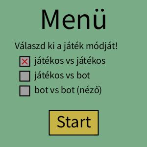
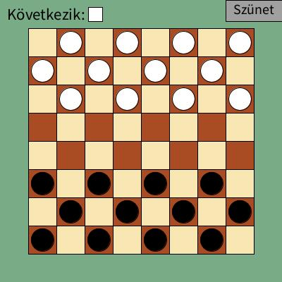
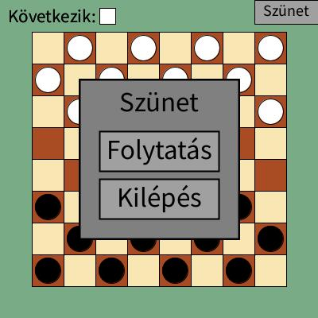
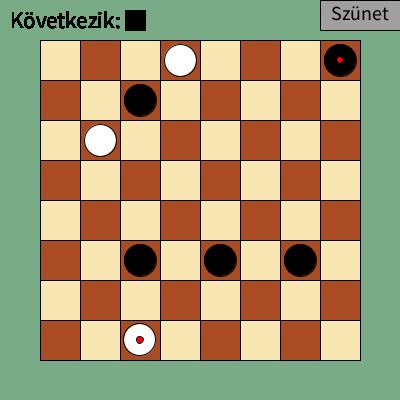
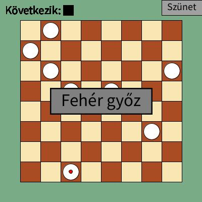
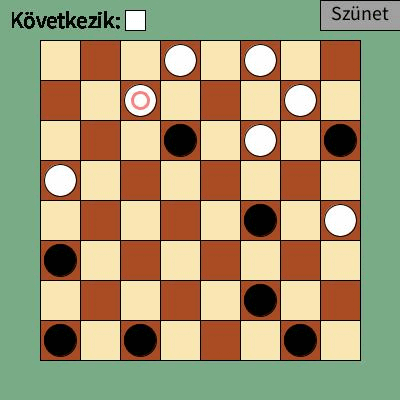

# ez-egy-projekt

Megj: Valóban, ez egy projekt

A projekt során egy egyszerű dámajátékot valósítottunk meg, melyben egy játékos játszat egy másik, vagy akár a számítógép ellen. A játék implementációja a klasszikus szabályokon alapszik, azaz van ütéskényszer, ami az ütéssorozatra is vonatkozik.

A projektet készítették:
- Novák Benedek Bálint
- Rózsay Domonkos
- Sándor Zsombor 

## Előfeltételek

A játék futtatásához a következők szükségesek:
- Pyhton 3.10 vagy újabb
- Java 17 vagy újabb
- py5 könyvtár 

Részletes telepítési útmutató: http://py5coding.org/content/install.html

A dámajáték programját a következő fájlok tartalmazzák:
- checkers.py
- game_pvp.py
- menu.py
- player_movement.py
- checkers_graphics.py

## Futtatás

A dámajátékot a checkers.py fájl elindításával tudjuk megkezdeni. Ekkor egy menü jelenik meg, ahol a választhatunk a lehetséges játékmódok közül.

A játékmód kiválasztása után a start gombra kattintva a játék elindul, és a következő képernyőre érkezünk:

Itt a bal felső sarokban azt látjuk, hogy éppen melyik játékos van soron (a lezajló animációk után). A jobb felső sarokban a szünet menü gombját találjuk, ez megállítja a játékot, és a következő menüt jeleníti meg:

A "Folytatás" gombbal visszatérhetünk a játékba, míg a "Kilépés" gombbal befejezhetjük a játékot a menübe lépve. A játék egy általános állapota a következőképp nézhet ki például; itt a piros pöttyel megjelölt bábuk a dámák.

Amennyiben az egyik játékosnak elfogynak a lépési lehetőségei, veszít. Ekkor a játék 3 másodpercig jelzi a nyertes játékost, majd visszakerülünk a menübe.

## Játékos lépése
Amikor játékoson van a sor, a játék megjelöli azon bábukat, melyekkel tud lépni. Ezt az ütéskényszer figyelembevételével teszi. A bábura kattintva a játék felajánlja a lépési lehetőségeket. Ha nem egy lehetőségre kattintunk, megszakítjuk a bábu lépését, azaz újra választhatunk a mozogni képes bábuk közül.

Amennyiben lépésként kiválasztunk egy ütést, ütéssorozat indul meg. Itt addig kell választanunk lépést, amíg olyan pozícióba kerül a bábu, ahol már nem tud ütni. Az ütéssorozatot már nem tudjuk megszakítani, ha egyszer megkezdjük a lépést.

## A bot taktikája

A bot döntését az alapján hozza, hogy végignézi saját és ellenfele lehetőségeit 3-3 lépéssel előre. Egyes lépések kiértékelése a kövekező módon történik:

- ütés: +1 pont
- dáma létrehozása: +1.5 pont 
- ellenfél üt: -1 pont
- ellenfél hoz létre dámát: -1.5 pont
- játék megnyerése: +100 pont
- játék elvesztése: -100 pont

A lépéssorozatokat a bot rekurzívan értékeli ki, olyan módon, hogy mindkét játékos ezen pontozás szerint a lehető legoptimálisabban próbálja léptetni. Ez alapján választja ki saját lépését. A bot működését demostrálja a következő bot vs. bot játék:

